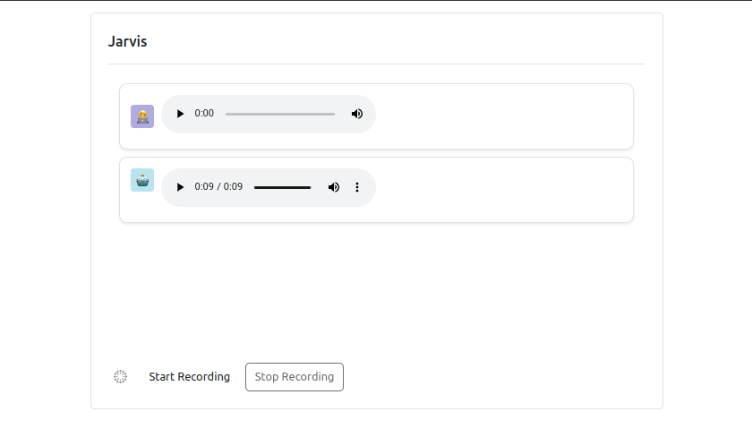

# Audio Chatbot with OpenAI Whisper API and Flask

This repository houses a project dedicated to the development of an advanced audio chatbot. By harnessing the capabilities of Python Flask and the OpenAI Whisper API, this chatbot delivers a seamless interaction experience.

## Key Features

- **OpenAI Integration:** Leverage the Whisper API from OpenAI for sophisticated and natural language understanding.
- **Flask Framework:** Utilize Flask to build a robust and scalable backend for the audio chatbot.
- **Frontend Testing Template:** Included is a user-friendly frontend template for easy API testing.
- **Audio Input and Output:** The chat interface is tailored for audio input, enabling users to interact with the chatbot using spoken words. OpenAI responses are delivered in audio format, enhancing the overall user experience.

## Getting Started

1. Clone the repository to your local machine.
2. Install the required dependencies following the provided setup instructions.
3. configure your openai api key in the `config.py` file.
4. Run the Flask application to start the chatbot server.
5. Access the frontend template (`http://127.0.0.1:5000`) to test the chatbot's functionality with audio interactions.


## Run Locally

Clone the project

```bash
  git clone https://github.com/smrussel/audio-chatbot-openai.git
```

Go to the project directory

```bash
  cd audio-chatbot-openai
```

Install dependencies

```bash
  pip install -r requirements.txt
```

Start the server

```bash
  python app.py
```


## Screenshots

### Web Ui




## License

This project is licensed under the [MIT License](./LICENSE).

